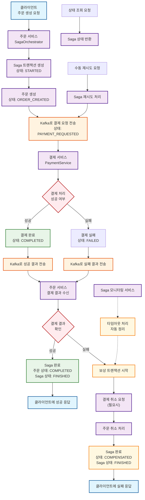

# Saga 패턴 - 전체 처리 흐름도

## 개요
주문-결제 시스템에서 Saga 패턴을 사용한 분산 트랜잭션 처리의 전체 흐름을 보여주는 다이어그램입니다.

## 주요 특징
- **오케스트레이션 방식**: 주문 서비스가 전체 Saga 흐름을 관리
- **보상 트랜잭션**: 실패 시 자동으로 이전 단계들을 롤백
- **비동기 통신**: Kafka를 통한 서비스 간 메시지 전달
- **모니터링**: 타임아웃 처리 및 상태 추적

## 처리 단계 설명

### 1. 정상 흐름 (Happy Path)
1. **클라이언트 요청**: POST /api/saga/orders
2. **Saga 시작**: 트랜잭션 ID 생성 및 상태 추적 시작
3. **주문 생성**: 로컬 DB에 주문 정보 저장
4. **결제 요청**: Kafka를 통해 결제 서비스로 요청 전송
5. **결제 처리**: 외부 결제 게이트웨이 호출
6. **결과 수신**: 결제 결과를 Kafka로 수신
7. **Saga 완료**: 모든 단계 성공 시 완료 처리

### 2. 실패 및 보상 흐름 (Compensation)
1. **실패 감지**: 결제 실패 또는 타임아웃 발생
2. **보상 시작**: 자동으로 보상 트랜잭션 실행
3. **역순 처리**: 이미 완료된 단계들을 역순으로 취소
4. **상태 업데이트**: COMPENSATED 상태로 변경

### 3. 모니터링 및 관리
- **타임아웃 처리**: 지정된 시간 내 완료되지 않은 Saga 자동 정리
- **상태 조회**: 실시간 Saga 상태 확인 API 제공
- **수동 재시도**: 실패한 Saga의 수동 재시도 기능 