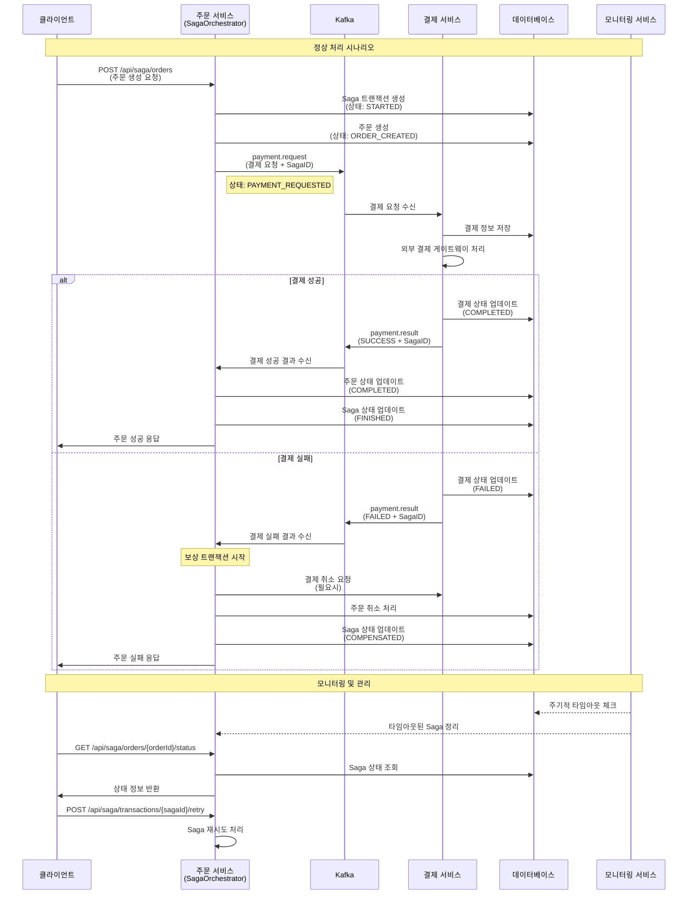

# Saga 패턴 - 서비스 간 상호작용 시퀀스

## 개요
주문-결제 시스템에서 각 서비스 간의 시간 순서에 따른 메시지 흐름과 상호작용을 보여주는 시퀀스 다이어그램입니다.

## 주요 참여자
- **클라이언트**: 웹/모바일 애플리케이션
- **주문 서비스**: Saga 오케스트레이터 역할
- **Kafka**: 비동기 메시지 브로커
- **결제 서비스**: 결제 처리 담당
- **데이터베이스**: 각 서비스의 데이터 저장소
- **모니터링 서비스**: Saga 상태 관리



## 시나리오별 상세 설명

### 🟢 정상 처리 시나리오 (Success Path)

1. **요청 시작**
   - 클라이언트가 주문 생성 API 호출
   - 주문 서비스가 요청을 수신하고 Saga 트랜잭션 시작

2. **주문 생성 단계**
   - Saga 트랜잭션 기록 생성 (STARTED)
   - 주문 정보를 DB에 저장 (ORDER_CREATED)

3. **결제 요청 단계**
   - Kafka를 통해 결제 요청 메시지 발송 (PAYMENT_REQUESTED)
   - SagaID가 포함된 결제 요청 전송

4. **결제 처리 단계**
   - 결제 서비스가 Kafka 메시지 수신
   - 결제 정보 DB 저장 및 외부 게이트웨이 호출

5. **성공 완료**
   - 결제 성공 시 결과를 Kafka로 전송
   - 주문 서비스가 결과 수신하여 상태 업데이트
   - 클라이언트에 성공 응답 반환

### 🔴 실패 및 보상 시나리오 (Compensation Path)

1. **실패 감지**
   - 결제 서비스에서 실패 발생
   - 실패 결과를 Kafka로 전송

2. **보상 트랜잭션 실행**
   - 주문 서비스가 실패 결과 수신
   - 자동으로 보상 트랜잭션 시작

3. **롤백 처리**
   - 필요시 결제 취소 요청
   - 주문 취소 처리
   - Saga 상태를 COMPENSATED로 변경

4. **실패 응답**
   - 클라이언트에 실패 응답 반환

### 🔍 모니터링 및 관리

1. **타임아웃 모니터링**
   - 모니터링 서비스가 주기적으로 DB 체크
   - 타임아웃된 Saga 자동 정리

2. **상태 조회**
   - 클라이언트가 Saga 상태 조회 요청
   - 실시간 상태 정보 반환

3. **수동 재시도**
   - 실패한 Saga의 수동 재시도 기능
   - 관리자 또는 자동화 도구에서 활용

## 메시지 포맷

### Kafka 메시지 구조

**결제 요청 (payment.request)**
```json
{
  "orderId": "ORDER-001",
  "amount": 50000,
  "currency": "KRW",
  "paymentMethod": "CARD",
  "sagaId": "saga-uuid-12345"
}
```

**결제 결과 (payment.result)**
```json
{
  "orderId": "ORDER-001",
  "status": "COMPLETED|FAILED",
  "message": "결과 메시지",
  "sagaId": "saga-uuid-12345"
}
``` 