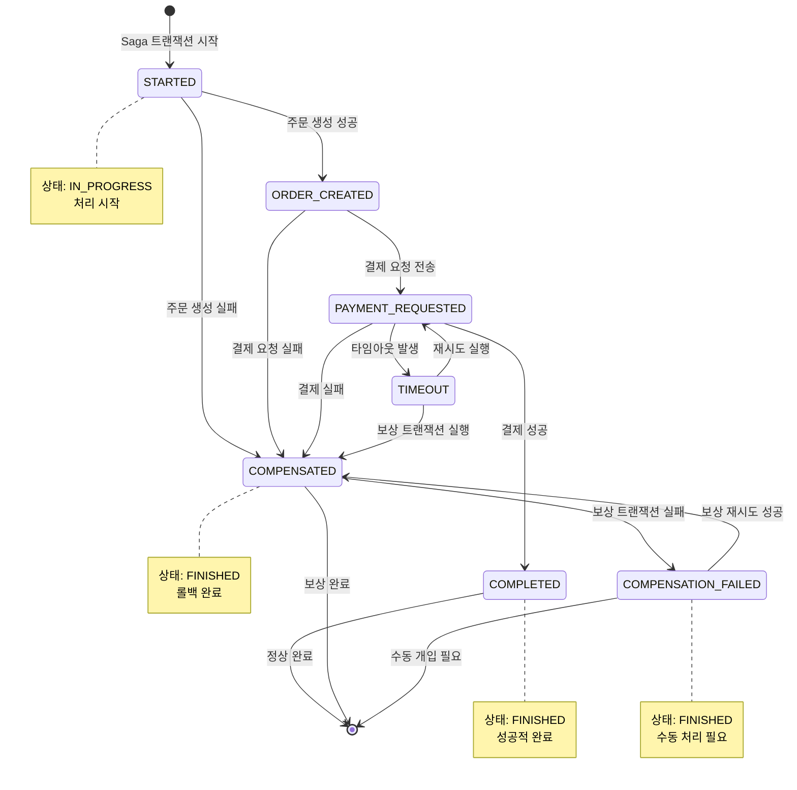

# Saga 패턴 - 상태 전이도

## 개요
Saga 트랜잭션의 생명주기 동안 발생하는 모든 상태 전이를 보여주는 상태 다이어그램입니다.

## 주요 상태 설명
- **STARTED**: Saga 트랜잭션 시작
- **ORDER_CREATED**: 주문 생성 완료
- **PAYMENT_REQUESTED**: 결제 요청 전송
- **COMPLETED**: 모든 단계 성공적 완료
- **COMPENSATED**: 보상 트랜잭션 완료 (롤백)
- **TIMEOUT**: 타임아웃 발생
- **COMPENSATION_FAILED**: 보상 트랜잭션 실패



## 상태별 상세 설명

### 🟢 정상 처리 경로 (Success Path)
```
[*] → STARTED → ORDER_CREATED → PAYMENT_REQUESTED → COMPLETED → [*]
```

1. **STARTED**
   - Saga 트랜잭션 ID 생성
   - 초기 상태 설정 (IN_PROGRESS)
   - 시작 시간 기록

2. **ORDER_CREATED**
   - 주문 정보 DB 저장 완료
   - 다음 단계 준비

3. **PAYMENT_REQUESTED**
   - Kafka로 결제 요청 메시지 전송
   - 결제 서비스 응답 대기

4. **COMPLETED**
   - 결제 성공 확인
   - 주문 상태 업데이트
   - Saga 상태를 FINISHED로 변경

### 🔴 실패 및 보상 경로 (Compensation Path)
```
각 단계에서 실패 시 → COMPENSATED → [*]
```

1. **보상 트랜잭션 시작**
   - 실패 단계 식별
   - 역순으로 보상 작업 수행

2. **COMPENSATED**
   - 모든 보상 작업 완료
   - 데이터 일관성 복구
   - Saga 상태를 FINISHED로 변경

3. **COMPENSATION_FAILED**
   - 보상 트랜잭션 실패
   - 수동 개입 필요
   - 알림 및 로그 기록

### ⏰ 타임아웃 처리 경로
```
PAYMENT_REQUESTED → TIMEOUT → COMPENSATED 또는 재시도
```

1. **TIMEOUT**
   - 설정된 시간 초과
   - 모니터링 서비스에서 감지

2. **재시도 또는 보상**
   - 재시도 가능한 경우: PAYMENT_REQUESTED로 복귀
   - 재시도 불가능한 경우: COMPENSATED로 전이

## 상태 전이 조건

### 성공 조건
- **STARTED → ORDER_CREATED**: 주문 생성 성공
- **ORDER_CREATED → PAYMENT_REQUESTED**: Kafka 메시지 전송 성공
- **PAYMENT_REQUESTED → COMPLETED**: 결제 성공 응답 수신

### 실패 조건
- **Any State → COMPENSATED**: 단계별 실패 발생
- **PAYMENT_REQUESTED → TIMEOUT**: 응답 시간 초과
- **COMPENSATED → COMPENSATION_FAILED**: 보상 트랜잭션 실패

### 재시도 조건
- **TIMEOUT → PAYMENT_REQUESTED**: 타임아웃 후 재시도
- **COMPENSATION_FAILED → COMPENSATED**: 보상 재시도 성공

## 데이터베이스 상태 필드

### SagaTransaction 테이블
```sql
CREATE TABLE saga_transactions (
    id BIGINT PRIMARY KEY,
    saga_id VARCHAR(255) UNIQUE NOT NULL,
    order_id VARCHAR(255),
    current_step VARCHAR(50),  -- 위 상태들 중 하나
    status VARCHAR(20),        -- IN_PROGRESS, FINISHED
    started_at TIMESTAMP,
    updated_at TIMESTAMP,
    finished_at TIMESTAMP
);
```

### 상태 매핑
- **current_step**: 위 다이어그램의 상태
- **status**: 
  - `IN_PROGRESS`: 처리 중인 상태
  - `FINISHED`: 최종 완료 상태 (COMPLETED, COMPENSATED, COMPENSATION_FAILED)

## 모니터링 포인트

### 알림 대상 상태
- **TIMEOUT**: 타임아웃 발생 시 즉시 알림
- **COMPENSATION_FAILED**: 수동 개입 필요 시 긴급 알림
- **PAYMENT_REQUESTED**: 장시간 대기 중인 경우 경고

### 메트릭 수집
- 각 상태별 소요 시간
- 성공률 vs 실패율
- 보상 트랜잭션 실행 빈도
- 타임아웃 발생 빈도 