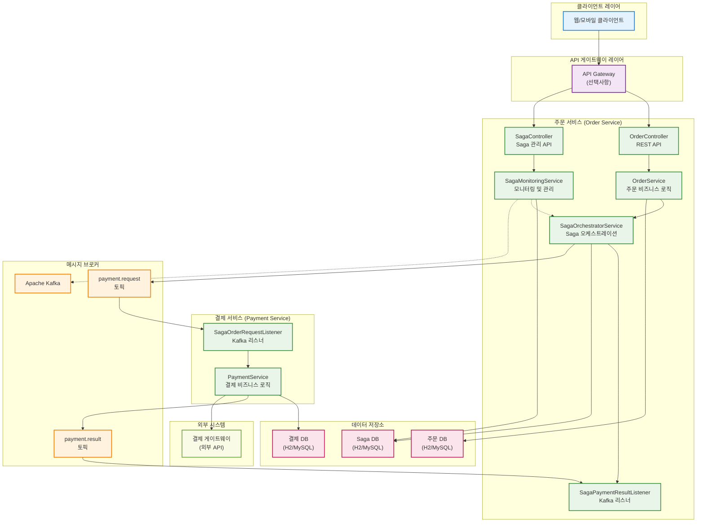

# Saga 패턴 - 시스템 아키텍처

## 개요
주문-결제 시스템의 전체 아키텍처와 각 컴포넌트 간의 관계를 보여주는 다이어그램입니다.

## 아키텍처 특징
- **마이크로서비스 아키텍처**: 서비스별 독립적 배포 및 확장
- **이벤트 기반 아키텍처**: Kafka를 통한 비동기 메시지 처리
- **오케스트레이션 패턴**: 중앙 집중식 Saga 관리
- **폴리글랏 퍼시스턴스**: 서비스별 독립적 데이터 저장소



## 컴포넌트 상세 설명

### 🌐 클라이언트 레이어
- **웹/모바일 클라이언트**: 사용자 인터페이스
- **API 게이트웨이**: 라우팅, 인증, 로드밸런싱 (선택사항)

### 🏪 주문 서비스 (Order Service)
**핵심 역할**: Saga 오케스트레이터 및 주문 관리

#### REST API 계층
- **OrderController**: 일반 주문 API 엔드포인트
- **SagaController**: Saga 관리 API 엔드포인트

#### 비즈니스 로직 계층
- **OrderService**: 주문 생성 및 관리 로직
- **SagaOrchestratorService**: 분산 트랜잭션 오케스트레이션
- **SagaMonitoringService**: Saga 상태 모니터링 및 타임아웃 처리

#### 메시지 처리 계층
- **SagaPaymentResultListener**: 결제 결과 수신 및 처리

### 💳 결제 서비스 (Payment Service)
**핵심 역할**: 결제 처리 및 외부 게이트웨이 연동

#### 비즈니스 로직 계층
- **PaymentService**: 결제 처리 로직 및 외부 API 호출

#### 메시지 처리 계층
- **SagaOrderRequestListener**: 주문 결제 요청 수신 및 처리

### 📨 메시지 브로커 (Apache Kafka)
**핵심 역할**: 서비스 간 비동기 통신

#### 토픽 구조
- **payment.request**: 주문 서비스 → 결제 서비스
- **payment.result**: 결제 서비스 → 주문 서비스

### 🗄️ 데이터 저장소
**핵심 역할**: 각 서비스별 독립적 데이터 관리

- **주문 DB**: 주문 정보 저장
- **결제 DB**: 결제 정보 저장
- **Saga DB**: Saga 트랜잭션 상태 저장

### 🔗 외부 시스템
- **결제 게이트웨이**: 실제 결제 처리 (PG사 API)

## 배포 구조

### 개발 환경
```yaml
version: '3.8'
services:
  order-service:
    image: order-service:latest
    ports:
      - "8080:8080"
    environment:
      - KAFKA_BOOTSTRAP_SERVERS=kafka:9092
      - DB_URL=jdbc:h2:mem:orderdb
    depends_on:
      - kafka
      - order-db
      
  payment-service:
    image: payment-service:latest
    ports:
      - "8081:8080"
    environment:
      - KAFKA_BOOTSTRAP_SERVERS=kafka:9092
      - DB_URL=jdbc:h2:mem:paymentdb
    depends_on:
      - kafka
      - payment-db
      
  kafka:
    image: confluentinc/cp-kafka:latest
    ports:
      - "9092:9092"
    environment:
      - KAFKA_ZOOKEEPER_CONNECT=zookeeper:2181
      - KAFKA_ADVERTISED_LISTENERS=PLAINTEXT://kafka:9092
      
  zookeeper:
    image: confluentinc/cp-zookeeper:latest
    ports:
      - "2181:2181"
    environment:
      - ZOOKEEPER_CLIENT_PORT=2181
```

### 프로덕션 환경 고려사항

#### 고가용성 (High Availability)
- **서비스 이중화**: 각 서비스 최소 2개 이상 인스턴스
- **Kafka 클러스터**: 3개 이상의 브로커 구성
- **데이터베이스 복제**: Master-Slave 구성

#### 확장성 (Scalability)
- **수평 확장**: 로드에 따른 인스턴스 자동 증감
- **Kafka 파티셔닝**: 처리량 증대
- **데이터베이스 샤딩**: 데이터 분산

#### 모니터링 및 관찰성
- **로그 수집**: ELK Stack 또는 Fluentd
- **메트릭 모니터링**: Prometheus + Grafana
- **분산 추적**: Jaeger 또는 Zipkin

## API 엔드포인트

### 주문 서비스 API
```
POST   /api/orders                    # 일반 주문 생성
GET    /api/orders/{orderId}          # 주문 조회

POST   /api/saga/orders               # Saga 기반 주문 생성
GET    /api/saga/orders/{orderId}/status    # Saga 상태 조회
GET    /api/saga/transactions/in-progress   # 진행 중인 Saga 목록
POST   /api/saga/transactions/{sagaId}/retry # Saga 재시도
```

### 결제 서비스 API
```
POST   /api/payments                  # 직접 결제 처리 (테스트용)
GET    /api/payments/{paymentId}      # 결제 조회
POST   /api/payments/{paymentId}/cancel # 결제 취소
```

## 보안 고려사항

### 인증 및 인가
- **JWT 토큰**: 서비스 간 인증
- **OAuth 2.0**: 클라이언트 인증
- **API 키**: 외부 게이트웨이 인증

### 네트워크 보안
- **서비스 메시 (Service Mesh)**: Istio 또는 Linkerd
- **TLS 암호화**: 모든 통신 구간 암호화
- **네트워크 정책**: Kubernetes NetworkPolicy

### 데이터 보안
- **데이터 암호화**: 개인정보 필드 암호화
- **감사 로그**: 중요 작업 추적
- **백업 및 복구**: 정기적 백업 및 복구 테스트 