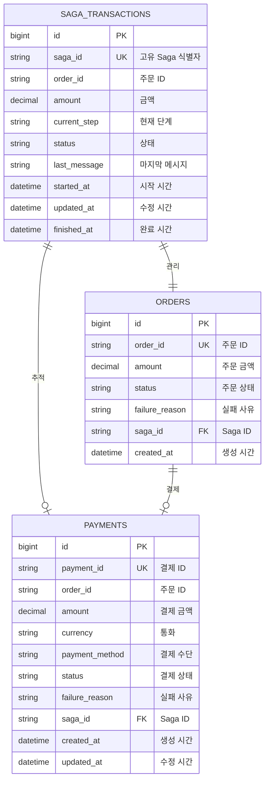

# Saga 패턴 - 데이터 모델 관계도 (ERD)

## 개요
주문-결제 시스템에서 사용하는 데이터 모델과 테이블 간의 관계를 보여주는 ERD(Entity Relationship Diagram)입니다.

## 데이터 모델 설계 원칙
- **서비스별 독립 데이터베이스**: 각 마이크로서비스가 독립적인 데이터베이스 운영
- **이벤트 소싱**: Saga 트랜잭션의 모든 상태 변화 기록
- **최종 일관성**: 분산 환경에서의 데이터 일관성 보장
- **감사 추적**: 모든 중요 변경 사항에 대한 추적 가능성



## 테이블 상세 설명

### 🔄 SAGA_TRANSACTIONS (Saga 트랜잭션)
**위치**: 주문 서비스 데이터베이스
**역할**: 분산 트랜잭션의 전체 생명주기 관리

#### 필드 설명
- **id**: 기본 키 (auto increment)
- **saga_id**: 전역 고유 식별자 (UUID)
- **order_id**: 연관된 주문 ID
- **amount**: 트랜잭션 금액
- **current_step**: 현재 처리 단계
  - `STARTED`, `ORDER_CREATED`, `PAYMENT_REQUESTED`, `COMPLETED`, `COMPENSATED`, `TIMEOUT`, `COMPENSATION_FAILED`
- **status**: 전체 상태
  - `IN_PROGRESS`: 처리 중
  - `FINISHED`: 완료 (성공/실패 무관)
- **last_message**: 마지막 상태 메시지
- **started_at**: 트랜잭션 시작 시간
- **updated_at**: 마지막 업데이트 시간
- **finished_at**: 완료 시간

#### 인덱스 설정
```sql
CREATE INDEX idx_saga_transactions_saga_id ON saga_transactions(saga_id);
CREATE INDEX idx_saga_transactions_order_id ON saga_transactions(order_id);
CREATE INDEX idx_saga_transactions_status ON saga_transactions(status);
CREATE INDEX idx_saga_transactions_started_at ON saga_transactions(started_at);
```

### 🛒 ORDERS (주문)
**위치**: 주문 서비스 데이터베이스
**역할**: 주문 정보 관리

#### 필드 설명
- **id**: 기본 키 (auto increment)
- **order_id**: 주문 고유 식별자
- **amount**: 주문 금액
- **status**: 주문 상태
  - `PENDING`: 처리 중
  - `COMPLETED`: 완료
  - `CANCELLED`: 취소
- **failure_reason**: 실패 사유 (실패 시에만)
- **saga_id**: 연관된 Saga 트랜잭션 ID
- **created_at**: 주문 생성 시간

#### 인덱스 설정
```sql
CREATE INDEX idx_orders_order_id ON orders(order_id);
CREATE INDEX idx_orders_saga_id ON orders(saga_id);
CREATE INDEX idx_orders_status ON orders(status);
CREATE INDEX idx_orders_created_at ON orders(created_at);
```

### 💳 PAYMENTS (결제)
**위치**: 결제 서비스 데이터베이스
**역할**: 결제 정보 관리

#### 필드 설명
- **id**: 기본 키 (auto increment)
- **payment_id**: 결제 고유 식별자
- **order_id**: 연관된 주문 ID
- **amount**: 결제 금액
- **currency**: 통화 코드 (KRW, USD 등)
- **payment_method**: 결제 수단
  - `CARD`: 신용카드
  - `BANK_TRANSFER`: 계좌이체
  - `MOBILE`: 모바일 결제
- **status**: 결제 상태
  - `PENDING`: 처리 중
  - `COMPLETED`: 완료
  - `FAILED`: 실패
  - `CANCELLED`: 취소
- **failure_reason**: 실패 사유 (실패 시에만)
- **saga_id**: 연관된 Saga 트랜잭션 ID
- **created_at**: 결제 생성 시간
- **updated_at**: 마지막 업데이트 시간

#### 인덱스 설정
```sql
CREATE INDEX idx_payments_payment_id ON payments(payment_id);
CREATE INDEX idx_payments_order_id ON payments(order_id);
CREATE INDEX idx_payments_saga_id ON payments(saga_id);
CREATE INDEX idx_payments_status ON payments(status);
CREATE INDEX idx_payments_created_at ON payments(created_at);
```

## 테이블 관계 설명

### 1:1 관계 (SAGA_TRANSACTIONS ↔ ORDERS)
- 하나의 Saga 트랜잭션은 정확히 하나의 주문을 관리
- 하나의 주문은 하나의 Saga 트랜잭션에 의해 관리됨

### 1:N 관계 (SAGA_TRANSACTIONS ↔ PAYMENTS)
- 하나의 Saga 트랜잭션은 여러 번의 결제 시도를 가질 수 있음
- 재시도 또는 부분 결제 시나리오에서 발생

### 1:N 관계 (ORDERS ↔ PAYMENTS)
- 하나의 주문은 여러 번의 결제 시도를 가질 수 있음
- 결제 실패 후 재시도 시나리오에서 발생

## DDL 스크립트

### 주문 서비스 DB
```sql
-- Saga 트랜잭션 테이블
CREATE TABLE saga_transactions (
    id BIGINT AUTO_INCREMENT PRIMARY KEY,
    saga_id VARCHAR(255) UNIQUE NOT NULL,
    order_id VARCHAR(255),
    amount DECIMAL(15,2),
    current_step VARCHAR(50) NOT NULL,
    status VARCHAR(20) NOT NULL,
    last_message TEXT,
    started_at TIMESTAMP DEFAULT CURRENT_TIMESTAMP,
    updated_at TIMESTAMP DEFAULT CURRENT_TIMESTAMP ON UPDATE CURRENT_TIMESTAMP,
    finished_at TIMESTAMP NULL,
    
    INDEX idx_saga_transactions_saga_id (saga_id),
    INDEX idx_saga_transactions_order_id (order_id),
    INDEX idx_saga_transactions_status (status),
    INDEX idx_saga_transactions_started_at (started_at)
);

-- 주문 테이블
CREATE TABLE orders (
    id BIGINT AUTO_INCREMENT PRIMARY KEY,
    order_id VARCHAR(255) UNIQUE NOT NULL,
    amount DECIMAL(15,2) NOT NULL,
    status VARCHAR(20) NOT NULL,
    failure_reason TEXT,
    saga_id VARCHAR(255),
    created_at TIMESTAMP DEFAULT CURRENT_TIMESTAMP,
    
    INDEX idx_orders_order_id (order_id),
    INDEX idx_orders_saga_id (saga_id),
    INDEX idx_orders_status (status),
    INDEX idx_orders_created_at (created_at),
    
    FOREIGN KEY (saga_id) REFERENCES saga_transactions(saga_id)
);
```

### 결제 서비스 DB
```sql
-- 결제 테이블
CREATE TABLE payments (
    id BIGINT AUTO_INCREMENT PRIMARY KEY,
    payment_id VARCHAR(255) UNIQUE NOT NULL,
    order_id VARCHAR(255) NOT NULL,
    amount DECIMAL(15,2) NOT NULL,
    currency VARCHAR(3) NOT NULL DEFAULT 'KRW',
    payment_method VARCHAR(20) NOT NULL,
    status VARCHAR(20) NOT NULL,
    failure_reason TEXT,
    saga_id VARCHAR(255),
    created_at TIMESTAMP DEFAULT CURRENT_TIMESTAMP,
    updated_at TIMESTAMP DEFAULT CURRENT_TIMESTAMP ON UPDATE CURRENT_TIMESTAMP,
    
    INDEX idx_payments_payment_id (payment_id),
    INDEX idx_payments_order_id (order_id),
    INDEX idx_payments_saga_id (saga_id),
    INDEX idx_payments_status (status),
    INDEX idx_payments_created_at (created_at)
);
```

## 데이터 일관성 전략

### 1. 보상 트랜잭션 (Compensating Transaction)
- 각 서비스는 자신의 데이터를 롤백할 수 있는 보상 로직 구현
- 예: 주문 취소, 결제 취소

### 2. 멱등성 (Idempotency)
- 동일한 요청이 여러 번 실행되어도 결과가 동일
- 중복 메시지 처리 방지

### 3. 이벤트 순서 보장
- Kafka 파티셔닝을 통한 메시지 순서 보장
- 동일한 주문 ID는 동일한 파티션으로 전송

### 4. 타임아웃 처리
- 각 단계별 타임아웃 설정
- 장시간 응답 없는 트랜잭션 자동 정리

## 모니터링 쿼리

### 진행 중인 Saga 조회
```sql
SELECT saga_id, order_id, current_step, 
       TIMESTAMPDIFF(MINUTE, started_at, NOW()) as elapsed_minutes
FROM saga_transactions 
WHERE status = 'IN_PROGRESS'
ORDER BY started_at DESC;
```

### 타임아웃 후보 조회
```sql
SELECT saga_id, order_id, current_step, started_at
FROM saga_transactions 
WHERE status = 'IN_PROGRESS' 
  AND TIMESTAMPDIFF(MINUTE, started_at, NOW()) > 30
ORDER BY started_at ASC;
```

### 성공률 통계
```sql
SELECT 
    DATE(started_at) as date,
    COUNT(*) as total_sagas,
    SUM(CASE WHEN current_step = 'COMPLETED' THEN 1 ELSE 0 END) as completed,
    SUM(CASE WHEN current_step = 'COMPENSATED' THEN 1 ELSE 0 END) as compensated,
    ROUND(SUM(CASE WHEN current_step = 'COMPLETED' THEN 1 ELSE 0 END) * 100.0 / COUNT(*), 2) as success_rate
FROM saga_transactions 
WHERE status = 'FINISHED'
  AND started_at >= DATE_SUB(NOW(), INTERVAL 7 DAY)
GROUP BY DATE(started_at)
ORDER BY date DESC;
``` 